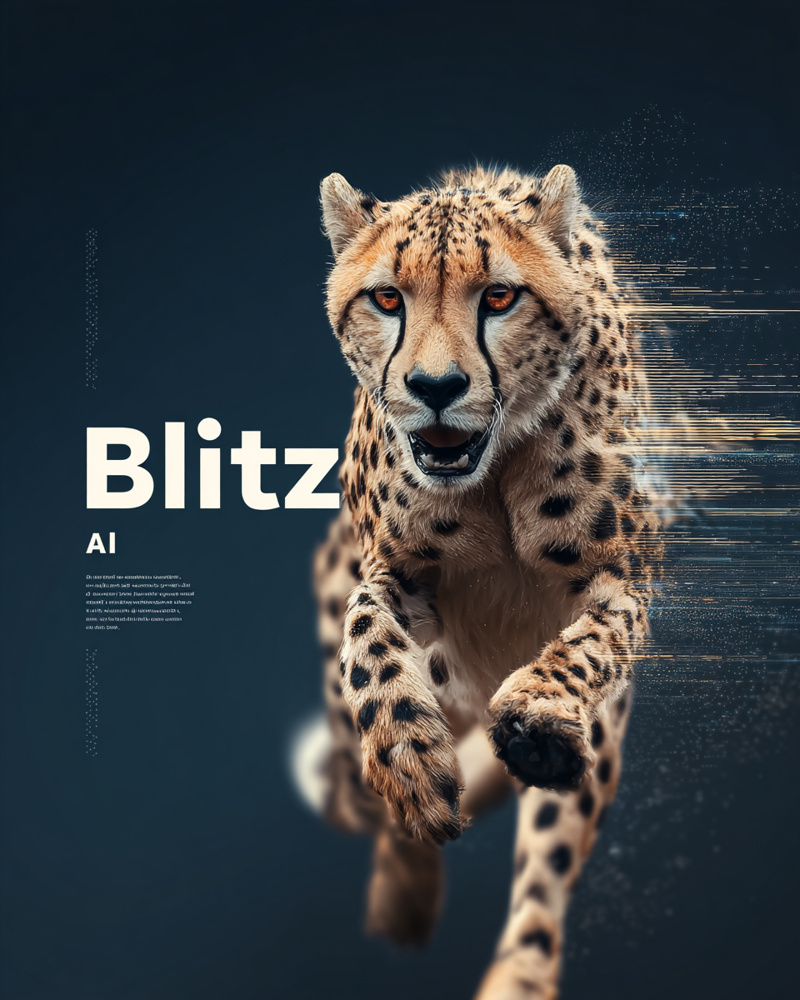
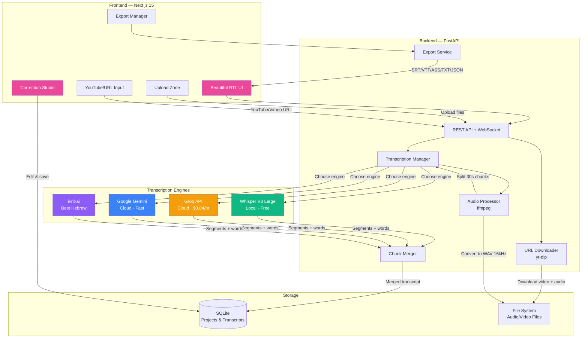
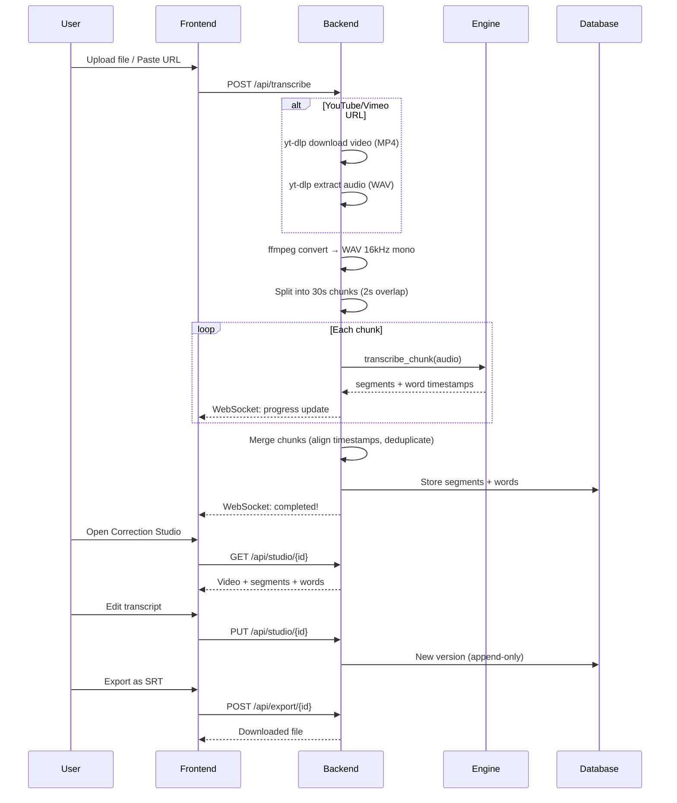
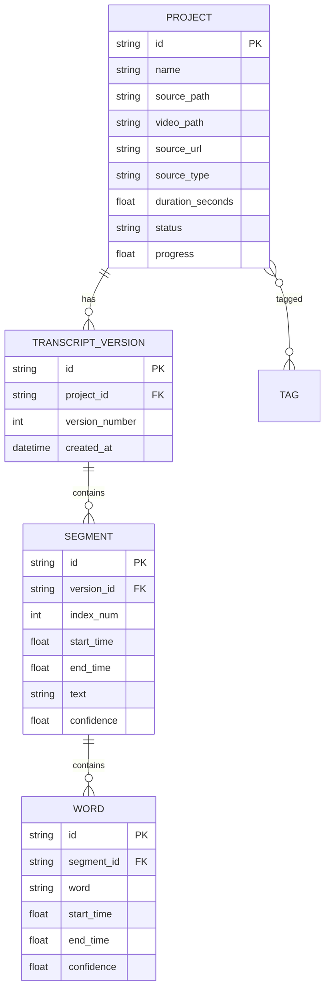

<div align="center">

# ⚡ Blitz AI



### Professional Transcription Studio

**The most powerful open-source transcription tool with Hebrew-first support.**

Transcribe any audio or video — local files, YouTube, Vimeo, entire playlists — with your choice of engine.

[](LICENSE)
[](https://fastapi.tiangolo.com)
[](https://nextjs.org)
[](#)

[Quick Start](#-quick-start) · [Features](#-features) · [Architecture](#-architecture) · [**מדריך בעברית**](SETUP_GUIDE.md) · [**LLM Setup Prompt**](LLM_SETUP_PROMPT.md)

</div>

---

## Why Blitz AI?

Most transcription tools treat Hebrew as an afterthought. **Blitz AI was built Hebrew-first** — RTL layout, Hebrew-optimized models, and a correction studio designed for right-to-left editing. But it works beautifully with any language.

### What makes Blitz AI different:

| Feature | Blitz AI | Otter.ai | Descript | MacWhisper |
|---------|-----|----------|---------|------------|
| Hebrew-first RTL UI | **Yes** | No | Partial | No |
| Local (free) transcription | **Yes** | No | No | Yes |
| YouTube/Vimeo download | **Yes** | No | Limited | No |
| Playlist batch processing | **Yes** | No | No | No |
| Video player in studio | **Yes** | No | Yes | No |
| Correction studio | **Yes** | No | Yes | No |
| 5 export formats | **Yes** | 3 | 4 | 3 |
| ivrit-ai Hebrew model | **Yes** | No | No | No |
| Open source | **Yes** | No | No | No |
| No subscription | **Yes** | $8-30/mo | $24+/mo | $75 once |

---

## Features

### Transcription Engines — Choose Your Power

| Engine | Speed | Cost | Best For |
|--------|-------|------|----------|
| **Whisper V3 Large** (Local) | ~1x real-time | Free | Privacy, no internet needed |
| **Groq Whisper** (Cloud) | 299x real-time | $0.04/hr | Speed, large batches |
| **Google Gemini** (Cloud) | Fast | ~$0.01/min | Multilingual, context |
| **ivrit-ai** (HuggingFace) | Varies | Free/Low | Best Hebrew accuracy |

### Input Sources

- **File upload** — Drag & drop any audio/video format (mp3, wav, mp4, mkv, mov, flac, ogg, webm...)
- **Multi-file upload** — Select dozens of files at once
- **Folder scan** — Point to a folder path, Blitz AI finds all media files recursively
- **YouTube** — Paste a video URL, Blitz AI downloads video + audio automatically
- **Vimeo** — Same magic, different platform
- **Playlists** — Paste a YouTube playlist URL, transcribe an entire course
- **1000+ sites** — Powered by yt-dlp, supports Dailymotion, Facebook, TikTok, Twitch...

### Correction Studio

- Video/audio player synced with transcript
- Click any segment to jump to that timestamp
- Edit text directly — every save creates a new version (infinite undo)
- Confidence highlighting for uncertain words
- Keyboard shortcuts (Ctrl+S save, F2 play/pause)
- Version history — go back to any previous edit

### Export Formats

| Format | Extension | Used By |
|--------|-----------|---------|
| **SubRip** | `.srt` | Premiere Pro, DaVinci Resolve, YouTube |
| **WebVTT** | `.vtt` | HTML5 video, web players |
| **Advanced SSA** | `.ass` | Aegisub, anime subtitles, complex styling |
| **Plain Text** | `.txt` | Docs, articles, summaries |
| **JSON** | `.json` | Developers, custom processing |

### Beautiful UI

- White + pink theme inspired by modern SaaS design
- Collapsible right sidebar (RTL-native)
- Full dark mode
- Responsive, desktop-first design
- Hebrew font (Heebo) optimized for readability

---

## Architecture



### Transcription Pipeline



### Database Schema



---

## Quick Start

> **🇮🇱 לא טכני?** יש [מדריך מפורט בעברית](SETUP_GUIDE.md) שמסביר כל שלב בשפת בני אדם.
>
> **🤖 מעדיף שה-AI יעזור?** העתיקו את ה-[LLM Setup Prompt](LLM_SETUP_PROMPT.md) ל-ChatGPT/Claude והוא ידריך אתכם.

### Prerequisites

- **OS:** Windows 10+, macOS 10.15+, or Linux (Ubuntu 20.04+)
  - ⚠️ Windows 7/8/8.1 are **not supported** (Node.js 18+ requires Windows 10+)
  - 🪟 See [**Windows Setup Guide**](WINDOWS.md) for Windows-specific instructions
- **Python 3.11+**
- **Node.js 18+**
- **ffmpeg** (`brew install ffmpeg` on macOS)
- **yt-dlp** (`pip install yt-dlp` or `brew install yt-dlp`)

### 1. Clone

```bash
git clone https://github.com/hoodini/blitzai.git
cd blitzai
```

### 2. Install & Run (Quick Way)

```bash
npm run setup   # Installs frontend + creates Python venv + installs backend deps
npm run dev     # Starts both backend and frontend
```

Open **http://localhost:3000** and start transcribing!

### Manual Setup (Alternative)

<details>
<summary>Click to expand manual setup steps</summary>

#### Backend

```bash
cd backend
python -m venv .venv
source .venv/bin/activate  # Windows: .venv\Scripts\activate
pip install -r requirements.txt

# Configure API keys (optional — local Whisper works without any keys)
# IMPORTANT: .env must stay inside backend/ — the app reads it from here
cp .env.example .env       # Windows: copy .env.example .env
# Edit .env to add your API keys (at least one: GROQ_API_KEY or HUGGINGFACE_API_KEY)
# Note: Groq free tier is limited to 20 requests/min — the app auto-paces and retries
```

#### Frontend

```bash
cd ../frontend
npm install
```

#### Run

```bash
# Terminal 1 — Backend
cd backend
uvicorn app.main:app --host 127.0.0.1 --port 8000 --reload

# Terminal 2 — Frontend
cd frontend
npm run dev
```

</details>

Open **http://localhost:3000** and start transcribing!

> 🪟 **Windows users:** You can also use `start.bat` to launch both servers at once. See the [Windows Setup Guide](WINDOWS.md) for full instructions.

### API Keys (Optional)

| Engine | Where to Get | Env Variable |
|--------|-------------|-------------|
| Groq | [console.groq.com](https://console.groq.com) | `GROQ_API_KEY` |
| Google Gemini | [aistudio.google.com](https://aistudio.google.com/apikey) | `GEMINI_API_KEY` |
| HuggingFace | [huggingface.co/settings/tokens](https://huggingface.co/settings/tokens) | `HUGGINGFACE_API_KEY` |

> **Note:** Local Whisper requires no API key — it runs entirely on your machine.
>
> **Groq free tier:** Limited to 20 requests/minute. Blitz AI automatically spaces requests to stay under this limit, so longer files may take a bit more time. Rate limit retries are handled transparently.

---

## Tech Stack

| Layer | Technology |
|-------|-----------|
| Frontend | Next.js 15, React, TypeScript, Tailwind CSS, shadcn/ui |
| Backend | Python, FastAPI, SQLAlchemy, Pydantic |
| Database | SQLite (WAL mode) |
| Audio | ffmpeg, yt-dlp |
| Local ASR | faster-whisper (CTranslate2) |
| Cloud ASR | Groq, Google Gemini, HuggingFace |

---

## Project Structure

```
blitzai/
├── backend/
│   ├── app/
│   │   ├── main.py              # FastAPI app + WebSocket
│   │   ├── config.py            # Settings & env vars
│   │   ├── database.py          # SQLite setup
│   │   ├── models.py            # SQLAlchemy models
│   │   ├── schemas.py           # Pydantic schemas
│   │   ├── engines/             # Transcription engines
│   │   │   ├── base.py          # Engine protocol
│   │   │   ├── faster_whisper.py
│   │   │   ├── groq_engine.py
│   │   │   ├── gemini_engine.py
│   │   │   └── huggingface_engine.py
│   │   ├── services/
│   │   │   ├── audio_processor.py    # ffmpeg operations
│   │   │   ├── url_downloader.py     # yt-dlp integration
│   │   │   ├── transcription_manager.py
│   │   │   ├── chunk_merger.py
│   │   │   └── export_service.py
│   │   └── routers/
│   │       ├── transcribe.py    # Upload/URL/folder endpoints
│   │       ├── projects.py      # CRUD
│   │       ├── studio.py        # Correction studio API
│   │       ├── export.py        # Export endpoints
│   │       └── settings.py
│   ├── requirements.txt
│   └── .env.example              # API key template (copy to .env)
├── frontend/
│   ├── src/
│   │   ├── app/                 # Next.js pages (RTL)
│   │   ├── components/          # React components
│   │   ├── stores/              # Zustand state
│   │   └── lib/                 # API client & utils
│   └── package.json
├── README.md
├── SETUP_GUIDE.md
├── WINDOWS.md
├── start.sh
└── start.bat
```

---

## Contributing

Contributions welcome! Areas to help:

- [ ] WaveSurfer.js waveform visualization
- [ ] Speaker diarization (who said what)
- [ ] Real-time WebSocket progress bar
- [ ] More export formats (EDL, FCPXML)
- [ ] Batch operations UI
- [ ] Docker support
- [ ] i18n (Arabic, Russian, English UI)

---

## License

MIT License — free for personal and commercial use.

---

<div align="center">

Built with passion by **[Yuval Avidani](https://yuv.ai)**

[](https://yuv.ai)
[](https://x.com/yuvalav)
[](https://instagram.com/yuval_770)
[](https://tiktok.com/@yuval.ai)
[](https://github.com/hoodini)
[](https://linktr.ee/yuvai)
[](https://facebook.com/yuval.avidani)

</div>
